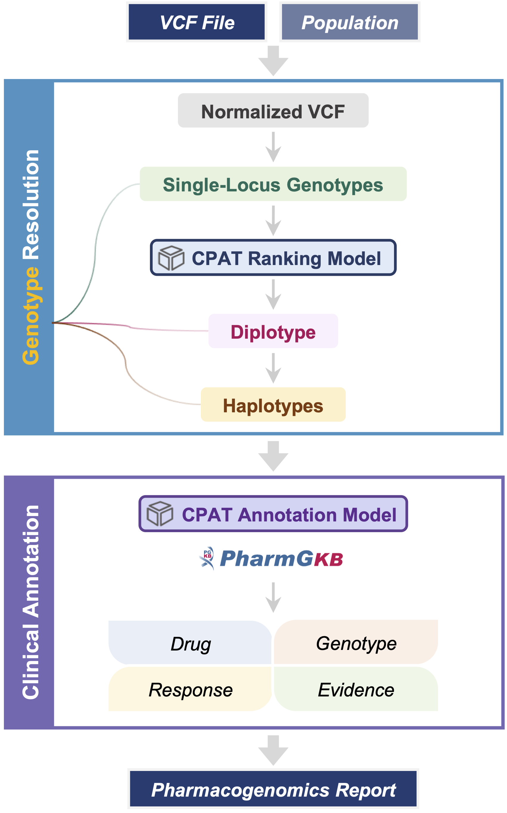

# CPAT

Annotation of pharmacogenomics relevant genotypes is a key component of clinical genomic testing. However, the inherent limitations of the currently widely used next generation sequencing make accurate calling of some genotypes still challenging, especially diplotypes. Therefore, <b>we developed an automated annotation tool, CPAT, which takes the germline variant calling format (VCF) file and population information as input and outputs an HTML report of drug responses with prescription recommendations.</b> CPAT implements a ranking model based on the allele definition and population frequency for the inference of diplotype, and its performance is validated in comparison with GeT-RM consensus and four other similar tools. CPAT further constructed an annotation model based on PharmGKB knowledge to summarize the **level of drug response** (<b>Decreased</b>, <b>Moderate</b>, <b>Increased</b>) and the **level of evidence** (<b>Level A</b>, <b>Level B</b>) for the resolved genotypes. In summary, CPAT is able to resolve, annotate and report germline variants of an individual, providing an end-to-end solution for clinical pharmacogenomics decision support.

## Status
CPAT is still under _active development_.
## Prerequisite
- Bash
- Python3 >= 3.7
## Input data
### VCF file
As the diplotype definitions only match to the human genome GRCh38 and given its increasing generality, CPAT requires that the VCF file is based on GRCh38.

### Population
There are nine biogeographic groups, i.e., African American/Afro-Caribbean, American, Central/South Asian, East Asian, European, Latino, Near Eastern, Oceanian, Sub-Saharan African.